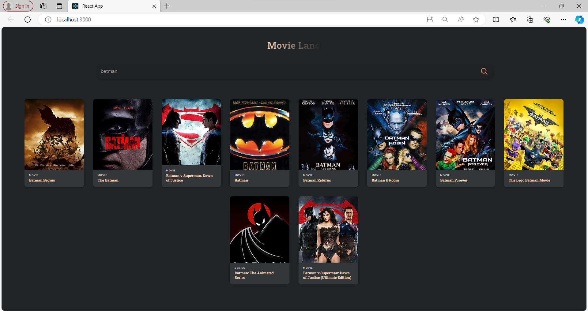

# Movie Land React App

Movie Land is a React.js application that allows users to search for movies using the Open Movie Database (OMDb) API. It provides a visually appealing interface to view movie details.



## Installation

To run the Movie Land React App locally, follow these steps:

1. Clone the repository:

   ```bash
   git clone [repository_url]
   ```

2. Navigate to the project directory:

   ```bash
   cd [project_directory]
   ```

3. Install dependencies:

   ```bash
   npm install
   ```

4. Start the development server:

   ```bash
   npm start
   ```

The app will be accessible at [http://localhost:3000](http://localhost:3000) in your web browser.

## Technologies Used

- React.js
- CSS (styled using `App.css`)

## External Dependencies

- OMDB API: The Open Movie Database API (https://www.omdbapi.com)

## Project Structure

- `App.js`: Main React component handling state and rendering.
- `App.css`: Stylesheet for the application.
- `MovieCard.jsx`: React component for rendering individual movie cards.
- `search.svg`: SVG file for the search icon.

## Data Source

The application fetches movie data from the Open Movie Database (OMDb) API.

## Contributing

Feel free to contribute to the development of Movie Land by submitting pull requests or reporting issues on the GitHub repository.

